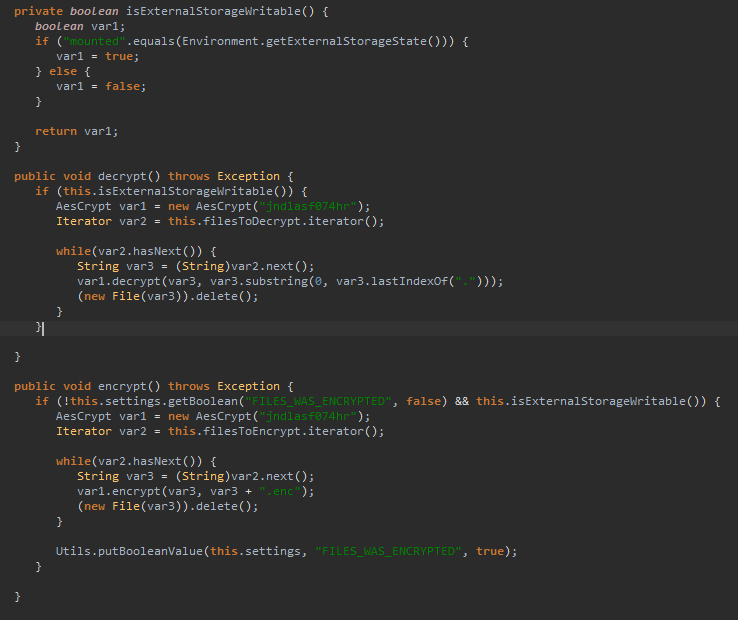

# Решение Лабы:
1. Переименовал файл в app.zip
2. Достал из него classes.dex
3. Потыкал разные слова связанные с шифрованием по глобальному поиску и нашёл эту часть кода;

Из неё предполагаю что ключ: jndlasf074hr

4. Написал python скрипт дешифровки файлов
5. Попробовал всунуть сразу ключ и ничего не получилось
6. Изучил функцию шифрования в коде хакера
7. Написал новый код
8. Всё получилось!

